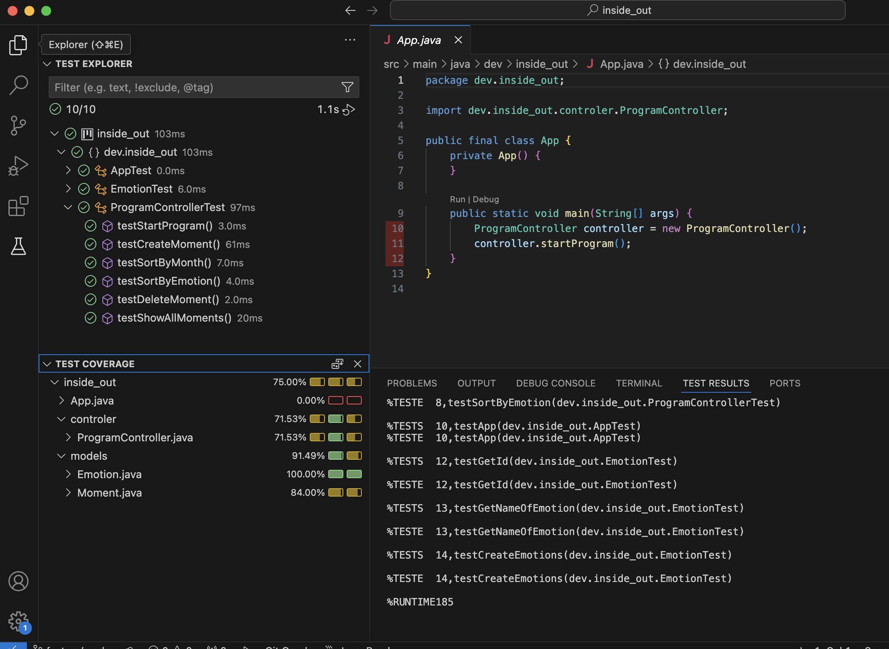
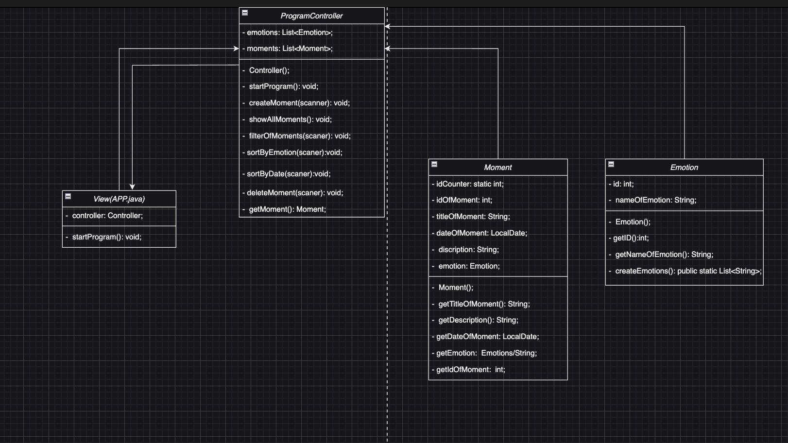

# inside_out
Inside Out

Inside Out is a console-based diary application that allows users to record significant moments along with the emotions they associate with those moments. Users can add, view, delete, and filter moments to keep track of their experiences and reflect on different emotional states.

Features

1. Add a Moment: Record a new moment by providing a title, date, description, and an associated emotion.
2. View All Moments: View a list of all recorded moments.
3. Delete a Moment: Delete a moment by specifying its unique ID.
4. Filter Moments:
  - By Emotion: Filter moments based on specific emotions.
  - By Date (Month): Filter moments by the month they occurred.

Project Structure

 - Emotion class: Manages a list of predefined emotions, each with an ID and name. Includes a method to generate a list of emotions.
 - Moment class: Represents a moment, containing a unique ID, title, date, description, and emotion.
 - ProgramController class: Controls the main flow of the application, managing moments and user inputs.
 - App class: The main entry point, initializing and running the ProgramController.

Technologies

Java: Core language for building the application.
JUnit: For unit testing of individual components (if applicable).

How It Works

 - Starting the Program: The main menu offers options to add a moment, view all moments, delete a moment, filter moments, or exit the program.
 - Adding a Moment:
    * Users enter a title, date (dd/MM/yyyy format), and description for the moment.
    * The program displays a list of emotions; users select an emotion by entering its corresponding number.
    * The moment is saved and added to the list of moments.
 - Viewing Moments: Displays all moments with details like title, date, description, and associated emotion.
 - Deleting a Moment: Users enter the moment's ID to delete it from the list.
 - Filtering Moments:
    * By Emotion: Allows filtering by a specific emotion.
    * By Date (Month): Filters moments by the selected month.

Installation

1. Download or clone this repository: git clone https://github.com/NepyAnna/inside_out
2. Open the project in your code editor (e.g., VS Code).

Coverage Tests

Diagram

Authors

Yuliana-Alcala ,
Andreina2 ,
NepyAnna ,
Volodymyr Yushkevich 
